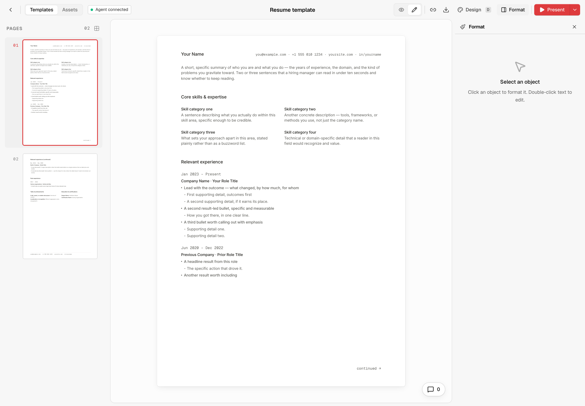

# resume-builder

A resume, as code. Your resume is a React component rendered onto a fixed **A4 page (794 × 1123 px)**, so layout, spacing and print output are exact instead of fighting a Word template. Edit it in a live visual editor, or hand it to a coding agent.



Built on [open-slide](https://github.com/open-slide/open-slide) by [Yiwei Ho](https://github.com/1weiho), adapted here for documents. See [how this differs from open-slide](docs/FORK.md).

## Get started

You need [Node.js](https://nodejs.org) 20.19+ (or 22.12+) and [pnpm](https://pnpm.io).

```bash
git clone <this repo>
cd resume-builder
pnpm install
pnpm sync:skills
pnpm dev
```

Open the address `pnpm dev` prints (usually <http://localhost:5173>) and open the **Resume template**.

## Make it yours

- **By hand.** Edit `slides/resume/index.tsx`. Changes appear instantly. You can also double-click text in the editor to change it in place.
- **With a coding agent.** Open the project in Claude Code (or another agent) and ask it to "build my resume". Point it at an existing resume, PDF or notes. It asks for your source material rather than inventing content.

Then export from the download button in the editor toolbar. PDF export needs a Chromium-based browser.

## Scripts

| Command | Description |
| --- | --- |
| `pnpm dev` | Start the editor with hot reload. |
| `pnpm build` | Build a static bundle you can deploy. |
| `pnpm preview` | Preview the built bundle locally. |
| `pnpm sync:skills` | Copy the authoring skills from `framework/core/skills/` into `.claude/skills` and `.agents/skills` for your coding agent. |

## How a resume is written

`slides/resume/index.tsx` default-exports an array of page components, one per A4 page:

```tsx
import type { Page, SlideMeta } from '@open-slide/core';

const ResumePage: Page = () => (
  <div style={{ width: '100%', height: '100%', padding: 48, boxSizing: 'border-box' }}>
    Your resume here
  </div>
);

export const meta: SlideMeta = { title: 'Resume' };
export default [ResumePage] satisfies Page[];
```

- **The page is fixed at 794 × 1123.** Content past the bottom edge is cropped, so when a section overflows, move whole entries to the next page.
- **Use pixel values** for type and spacing (the template uses 12px body text and 48px padding).
- **Build bullets as components.** Write each bullet as `<Bullet label="…">` with nested `<SubBullet text="…" />` children. Don't use one paragraph or a `.map()`. This keeps every line separately editable in the visual editor.
- **Assets** (a headshot, for example) go in `slides/resume/assets/`.

[`AGENTS.md`](./AGENTS.md) has the full rules for coding agents.

## Present mode

Present mode shows the page at 100% (794px wide on screen), centered. Scroll to see the rest of the page. Use the left and right arrow keys to change pages.

## Credits and license

MIT. This project includes code from [open-slide](https://github.com/open-slide/open-slide) (MIT, © Yiwei Ho); see [`framework/core/LICENSE`](./framework/core/LICENSE). What was changed, and how to pull in upstream updates, is in [docs/FORK.md](docs/FORK.md).
